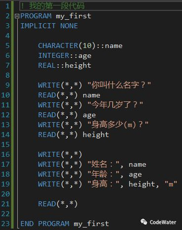

# Fortran基础篇01：爱之初印象

***提示***：还没装编译器的小伙伴参考上一篇[《编译器及版本》](Fortran系列：编译器及版本.md)。

话不多说，先上代码（别嫌弱智）

程序的执行需要一个起点，在Fortran中，这个起点就是PROGRAM（第2行）。PROGRAM是Fortran的关键字之一，用于标明程序的入口，类似于C语言中的main，PROGRAM后面跟的my_first是程序名，这个名字可以自定义。与PROGRAM相呼应的是END PROGRAM（第23行），标志程序的结束，通常情况下，程序会执行到这里安全退出，但也有中途发生意外的可能。END PROGRAM后面的程序名可写可不写，如果写了，则必须与前面PROGRAM的程序名一致。老代码中可能遇到只有END而不带PROGRAM的情况，这样也能通过编译并执行，但新代码中不推荐这种写法，含义不明，容易引起混乱（不只PROGRAM有END，IF、DO也有）。

Fortran对字母**大小写不敏感**，也就是说PROGRAM可以写成program或Program，但这不意味着你可以随便写成pRoGrAm。代码首先是给人阅读的，其次才是计算机执行，好的代码风格会让人一目了然，神清气爽。示例中所有的关键字（蓝色字体）都使用了大写，而其它自定义的名称则采用了小写。无论你使用哪种风格的写法，切记不能混乱。

知道程序的起点和终点在哪儿以后，我们再回头看示例代码中都有哪些内容。

------

第1行由英文感叹号(!)引导的内容为注释，注释是给人看的，编译器在解析代码的时候会自动忽略这些注释内容。注释引导符(!)可以位于行首，也可以位于行中间任意位置，无论在哪儿，从!开始到行尾的所有内容均为注释。一段好的代码必需有恰到好处的注释，既不啰嗦，也能说明问题。

------

第2-7行为程序的**声明部分**，用于定义程序名、程序引用的数据、以及程序中用到的变量等。

第2行PROGRAM my_first定义程序名为my_first。

第3行IMPLICIT NONE为Fortran关键字，其作用是关闭默认式变量。所谓默认式变量，即无需像第5-7行那样事先定义变量，编译器根据变量名自动判断其类型。听起来好像很高级，其实并没有想象中的那么好，试想一下你在敲代码的过程中误将name写成nmae，编译器自作聪明地为你新生成了一个变量，导致出现莫名其妙地错误，有点得不偿失。所以在新代码中，大家统一写上IMPLICIT NONE，养成习惯。该语句位于PROGRAM语句之后，变量声明语句之前。

第5行CHARACTER(10)::name定义了一个字符串变量name，可以向name中存放至多10个英文字符（一个中文字符占两个英文字符）。如果写成CHARACTER::name则只能存放一个英文字符。

第6行INTEGER::age定义了一个整型变量age，可以向age中存入一个整数。整数的范围与INTEGER类型所对应的字节数有关，通常为4字节，范围大概在正负21亿之间，基本满足我们的日常需求。如果需要更大范围的整数，定义形式略有不同，具体在进阶篇中讲解。

第7行REAL::height定义了一个实型变量height，可以向height中存入一个实数。实数范围足够我们日常使用，更高精度和更大范围的实数定义在进阶篇中讲解。

***注意***：变量定义时采用了双冒号(::)分隔变量类型和变量名，老代码中可能没有这种写法，新代码中推荐带上，当变量类型有多个关键字声明时，必须带上双冒号。

------

从第9行开始为程序的**执行部分**，即对数据做真正意义上的操作。

WRITE(*,*)函数用于向控制台（就是那个像cmd的黑窗）输出。双引号("")中的内容是字符串常量。多个值的输出可依次写在WRITE(*,*)后面，如第17-19行所示。不接任何值的WRITE(*,*)函数（第16行）将输出一个空行。

READ(*,*)函数用于从控制台读取内容，读取的值将存入READ(*,*)后面指定的变量中。注意输入的值要与对应变量的类型一致，如果在执行第12行读取整数时输入了字符串，则会引发程序错误终止。不接任何值的READ(*,*)函数（第21行）等代读取，但不做任何处理，直接运行程序的时候，程序结束将自动关闭窗口，来不及看输出内容，可用此法让程序暂停（新代码中尽量避免使用PAUSE、STOP等旧语法）。

----

***关于缩进***

好的缩进能让代码看起来整洁有序，Python算是把它做到了极致，直接纳入语法范畴。Fortran对缩进没有强制要求，但**强烈建议**同级代码使用一致的缩进，上面的示例代码只有PROGRAM下的一级，因此统一缩进了1个Tab(=4空格)，等后面代码复杂以后就能体会到好的缩进能使整个编程更加轻松舒适。

最后看一下运行效果，可以看出，输出的姓名只有“一二三四五”(10字符)。聪明的你有没有注意到，输出内容最前面都有一个空格？更高级的输出格式控制将在后面的文章中讲解，敬请期待！

