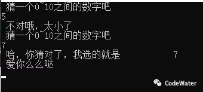
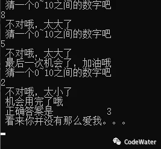

# Fortran基础篇02：你能猜到吗

*预警：本章篇幅较长，上车请系好安全带，熟悉分支和循环的同学可以直接到终点看示例代码——猜数字游戏。（PS：有时间还是从头看一遍吧）*


通过上一篇[《爱之初印象》](Fortran基础篇01：爱之初印象.md)，相信大家已经对Fortran有了初步了解，知道一段Fortran代码从哪儿开始，到哪儿结束，中间都能干点啥。今天继续说说所有编程语言共有的一些特性：程序的执行顺序。


代码是一句一句、一行一行写出来的，计算机的任务就是按照一定顺序把这些代码所描述的动作或行为表现出来。那么问题来了，计算机怎么知道先执行哪句后执行哪句？最直观的答案是从前往后按顺序来，就像我们阅读一样。那么问题又来了，每个动作都要写一句代码，编程还是让人享受的吗？


让我们先看看日常生活中的情况吧，早上起床，洗漱完出去吃早餐，如果有肉包子就买肉包子，没有肉的素的也行，包子卖完了的话就整点豆浆油条吧，吃完开始一天的工作，下班回家刷剧打游戏，睡一觉又到了起床吃早餐的时候了，然后重复着。程序也是一样，按照顺序从前往后执行，有时会面临选择，干完一天太累了回到起点重复一遍吧。这就是程序的三大结构：顺序、分支和循环。


顺序结构很简单，就是从前往后，从上到下。分支结构意味着一种选择，可以执行这个分支，也可以执行那个分支，具体看分支的判断条件。循环结构是程序简化任务的利器，是编程让生活更简单的重要原因，循环中再赋予变化，程序就活了（活太久是会成精的）。


**逻辑值**

------

讲分支和循环之前得先了解逻辑值及其运算。逻辑值大概是最简单的一种数据类型，不是真的就是假的，像小孩子的是非观那样纯粹。Fortran中表示逻辑值的常量是.TRUE.和.FALSE.（注意前后有点号），使用方式如下：

```Fortran
LOGICAL::var    !声明一个逻辑变量var
var = .TRUE.    !令var为真
var = 0      	!令var为假，
!数值0代表.FALSE.，非0代表.TRUE.
!建议以.TRUE.和.FALSE.的形式赋值，意义明确
```

（注：代码部分可以左右拖动哦，手机上使用非等宽字体时，显示对得不是很齐，电脑上效果会好些）


通常逻辑变量的赋值不是直接给定，而是通过某种比较运算得到（或者在分支中作不同的赋值），这样才能体现程序的变化性。Fortran中的关系逻辑运算如下：

```Fortran
LOGICAL::var    !声明逻辑变量
!中间定义两个变量v1和v2
var = v1 op v2  !op为关系逻辑运算符，有如下选择：
    !  ==  或  .EQ.  表示两值相等(equal to)
    !  /=  或  .NE.  表示两值不等(not equal to)
    !  >   或  .GT.  表示大于(greater than)
    !  >=  或  .GE.  表示大于或等于(greater than or equal to)
    !  <   或  .LT.  表示小于(less than)
    !  <=  或  .LE.  表示小于或等于(less than or equal to)
```

***注意***：很多编程语言中比较两个值是否相等用的是双等于号(==)，而不是数学上的等于号(=)，程序中的=用于变量赋值，这是很多新手容易出错的地方。早期Fortran的运算符都是两个点号围起来的（如.EQ.)，老代码中可能经常遇到这种用法，现在Fortran中的自定义运算符同样保留这种习惯，数学符号(>,<等）是后来才引入的。


数值之间的比较会产生逻辑值，逻辑值与逻辑值之间的组合也能产生新的逻辑值，具体如下：

```Fortran
LOGICAL::var    !声明逻辑变量
LOGICAL::v1,v2  !声明逻辑变量
...             !给v1, v2赋值
var = .NOT. v1       !逻辑非，真即假，假即真
var = v1 .AND. v2    !逻辑与，一假即假
var = v1 .OR. v2     !逻辑或，一真即真
var = v1 .EQV. v2    !逻辑等值，同真或同假即为真
var = v1 .NEQV. v2   !逻辑非等值，一真一假即为真
```


**分支**

------

分支的语法是很直观的，“如果”这个“条件”是真的，“那么”执行这一段代码，“否则”的话，执行那一段代码，最后”结束“。用代码表示出来就是：

```fortran
LOGICAL::do_you_love_me
!给do_you_love_me赋值
IF (do_you_love_me) THEN
    WRITE(*,*) "这还差不多！"
ELSE
    WRITE(*,*) "你想造反吗？！"
END IF
```

是不是很简单？聪明的骚年不用多解释了吧。如果有多种选择呢？上代码：

```fortran
IF (go_for_a_walk) THEN
    WRITE(*,*) "好，去公园吧"
ELSE IF (go_to_movies) THEN
    WRITE(*,*) "嗯，最近复联4上映了"
ELSE IF （go_to_eat) THEN
    WRITE(*,*) "哈，火锅怎么样"
ELSE
    WRITE(*,*) "难道你想去酒店写代码？？？"
END IF
```

透露一下，IF结构中还可以嵌套IF哦，俄罗斯套娃见过没？注意一下缩进层级就好了。嵌套多了分不清怎么办？给你的IF取个名字啊，看示例：

```fortran
zhangsan: IF (...) TEHN
    lisi: IF (...) THEN
        ...
    END IF lisi
ELSE zhangsan
    wangwu: IF (...) THEN
        ...
    END IF wangwu
END IF zhangsan
```

每个IF结构都有相应的END IF作为结束的标记，END IF可以写成ENDIF（不带空格）或者END。老代码中常见一个光杆END，不知它是IF的END，还是后面要讲的DO的END，还是PROGRAM的END，所以写END的时候一定记得带上相应的IF/DO/PROGRAM，让自己看得明白点，少犯错误。


对于简单的条件判断，可以用IF语句，而不需要IF结构，比如：

```fortran
IF (satisfied) THEN
    balabala
END IF
!与下面等效
IF (satisfied) balabala    !注意要写在同一行哦
```


除了IF结构的分支，还有一个SELECT结构的分支，如下：

```fortran
!中括号与name可写可不写，表示SELECT的名称，类似IF结构的名称
!var表示一个待选择的值，通常为一个变量或表达式
!value_1和value_2为var可能的值
[name:] SELECT CASE (var)
CASE (value_1) [name]
    ...
CASE (value_2) [name]
    ...
CASE DEFAULT [name]
    ...
END SELECT [name]
```

上述代码在执行过程中，会根据var的值判断进入哪一个CASE块，如果没有找到对应的值，则进入CASE DEFAULT块。注意：var必须是整数、字符或逻辑值。value_1、value_2等可以单个值、多个值或某一范围，如CASE (1,2)表示var为1或2时的选择，CASE (:0)表示小于等于0的值，CASE (1:10)表示整数从1到10的范围，依此类推。


有人可能会问：这跟IF不是一样吗？干嘛要SELECT？答案是不一样。IF在判断条件时会从上到下挨个儿判断，直到找到合适的分支块（如果一个都不满足，则不执行IF块中的内容）。SELECT在选择时不是从第一个CASE挨个儿判断下来的，是直接跳转过来，在面对多项选择时，使用SELECT比使用IF更直观，也更有效率。但SELECT只能进行整型（字符和逻辑值也可算作整型）的判断，IF则可进行更为多样的判断。


**循环**

------

循环表示同一段代码被反复执行。循环是有条件的，当条件不满足的时候，循环就会终止，程序继续往后执行。如果条件永远满足，则进入死循环。Fortran中的循环有如下几种形式：

```fortran
!1.一直循环，中间某一条件满足时退出循环
DO
    ...
    IF (no_need_to_loop) EXIT
    ...
END DO

!2.当某一条件满足时进行循环，否则退出循环
DO WHILE (condition)
    ...
END DO

!3.计数循环
INTEGER::index,istart,iend,istep
...
DO index = istart, iend, istep
    ...
END DO
```

第1种用于当循环次数不确定，通过某一条件进行判断的循环。第2种与第 1种类似，判断的条件移到了循环最开始，第2种完全可被第1种取代，因此新代码中不推荐。第3种用于确定循环次数的循环，index将从istart开始，每循环一次加上一个istep，直至index>iend，退出循环，默认istep为1。


循环中会用到两个关键字，EXIT和CYCLE。EXIT用于退出当前的循环，CYCLE用于跳过CYCLE之后的部分重新开始循环。同IF和SELECT一样，DO结构也可以命名，对于嵌套DO循环而言，EXIT和CYCLE只作用于其所处的DO循环层，如果要对更外层的DO循环起作用，可以EXIT或CYCLE后面跟上相应的DO循环名称，例如：

```fortran
outer: DO i = 1, 10
    inner: DO j = 1, 20
        IF (i == j) CYCLE outer
        ...
    END DO inner
END DO outer
```

如果CYCLE后面没有outer，CYCLE将重新进行inner循环。


**猜数字**

------

下面代码是猜数字游戏，里面用到了今天学的IF、SELECT和DO，大家结合注释好好理解一下，自己运行看看效果怎么样，学代码是不是很好玩

```fortran
! 猜猜我心里那个数
PROGRAM guess_me
IMPLICIT NONE

    REAL::rand          !随机数
    INTEGER::secret     !秘密数字
    INTEGER::guess      !猜测数字
    INTEGER::num_chance !试猜机会
    INTEGER::i          !循环变量
    
    !生成0~1之间的随机数
    CALL RANDOM_SEED()
    CALL RANDOM_NUMBER(rand)

    !四舍五入取整
    secret = NINT(10*rand)
    
    !设置猜的次数
    num_chance = 3

    !开始猜数字
    DO i = num_chance, 0, -1
        SELECT CASE (i)
        CASE(0)
            WRITE(*,*) "机会用完了哦"
            WRITE(*,*) "正确答案是", secret
            WRITE(*,*) "看来你并没有那么爱我。。。"
        CASE DEFAULT
            IF (i == 1) THEN
                WRITE(*,*) "最后一次机会了，加油哦"
            END IF
            WRITE(*,*) "猜一个0~10之间的数字吧"
            READ(*,*) guess
            IF (guess == secret) THEN
                WRITE(*,*) "哈，你猜对了，我选的就是",secret
                WRITE(*,*) "爱你么么哒"
                EXIT
            ELSE IF (guess < secret) THEN
                WRITE(*,*) "不对哦，太小了"
            ELSE
                WRITE(*,*) "不对哦，太大了"
            END IF
        END SELECT
    END DO

    READ(*,*)

END PROGRAM guess_me
```

给几张运行效果图



