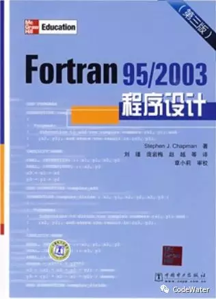

# Fortran系列：写在前面

Fortran是一门比较古老的语言，具体介绍咱不做搬运工，有兴趣的小伙伴可以自行搜索。之所以从Fortran系列写起，是因为很多研究生的入门编程语言是它（我也一样），学这个能直接对自己的科研工作产生效益。其实现在CS界很少谈及Fortran了，编程领域我们听得最多的是Java、C/C++、Python等，现在还用Fortran“造武器”的估计只剩科研人员了。上一篇[《开篇辞》](开篇辞：谈谈编程与科研.md)中说到历史遗留原因，这恐怕是最主要的一个原因，Fortran对于数学计算而言可以说是简洁优美高效，连以速度著称的C语言都不能与之媲美（C语言在数组的表达与计算方面不是很友好），导致对数学计算需求较大的科研领域深深扎根在了Fortran。所以当你出门跟别人说你在用Fortran的时候，等于告诉别人你在搞科研或正在前往科研的路上。

现实已经是这个样子了，我们不可能把那么多代码全部改写一遍，既然想偷懒用别人的代码，就得先学好它。那么问题来了，这玩意儿好学吗？幸运的是Fortran比较简单，一批又一批的研究生证明，如果要学一年半载，大部分人都要延期，而事实并不是这样。不幸的是关于Fortran的资料不多，远远少于C/C++、Python之类的资料，导致学习环境受限，遇到问题很难在网上找到解答，这是制约学习的一个主要瓶颈。估计不会有老师要求自己的学生成为一个Fortran高手，基本上会个30%就够你应付各种小问题了，所以把Fortran学到咱们需要的程度还是不成问题的。

Fortran的资料虽然不多，但还是有经典的，比如上面这本，我当时用的就是这个，现在好像出到第四版了。国人也写过几本薄点的教材，但我还是推荐这个，理由有三：1.厚本子内容充实，知识点涵盖的全面，而且讲得详细；2.老外写书有个特点，语言通俗易懂，写书是为了传播知识，而不是突显自己NB；3.习惯！习惯！习惯！重要事情说三遍，全书多次强调编程的习惯问题，好的编程习惯将使你受益终身，很多学生甚至老师写的代码真的是不堪入目:joy:，如果你是初学编程，这本书会给你带个好头。后面Fortran系列的文章我将主要参考这本教材。关于网上资源，推荐给大家一个网站[Fortran Coder](http://fcode.cn/)，里面东西很多，大家没事可以长长见识。

编程是离不开电脑的，更离不开编译器，关于编程的工具准备我会在下一篇详细讲解。下面说说这个系列教程的规划：

------

Fortran系列分三个部分：基础篇，进阶篇和应用篇。

基础篇讲最基本的语法特性，学完基本能上手日常工作。进阶篇讲更深一层的语言知识，学完能注意到效率及安全性方面的问题。应用篇以常用的数学计算问题做为实战演练。最终目标是结合水利专业的一个实际问题***（圣维南方程控制的明渠非恒定流）***进行编程求解，真正做到学以致用。

小伙伴们心动了吗？赶紧加入学习行列吧:wink: