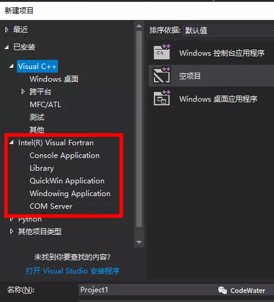

# Fortran系列：编译器及版本

计算机作为一个物理硬件，只认识电路的通和断，用我们人类的表示法就是0和1，即我们平常所说的二进制(binary)。不管多么复杂的程序，要想在计算机上执行，就得转换成计算机能懂的二进制指令。但我们从来没写过甚至很少见二进制指令，这都要归功于CS界的前辈，制定了一套很好的翻译系统，将二进制指令一层层包装成我们能看懂的文字符号，这些符号就是我们平常所说的代码。将代码翻译成二进制指令的过程叫作编译(compile)。一段Fortran代码想要在计算机上执行(run)，需借助Fortran编译器编译生成一个可执行程序(executable program)，在Windows系统中即.exe文件，最后运行的是这个.exe文件，而不是Fortran源代码。

Fortran编译器有很多，本系列演示用的是Intel Visual Fortran (IVF)，如果你有其它可用编译器，则不需要下面介绍的安装过程，代码都是通用的。IVF并不是一个独立的安装程序，需要依托于Visual Studio (VS)平台，VS是微软的集成开发环境(IDE)，用于各类代码的开发测试（Basic、C#、C/C++等，唯独没有Fortran）。因此VS为我们提供了开发的平台和环境，IVF则进行Fortran代码的解析与编译（有点像一个插件）。

现在VS社区版已免费提供给大家使用，作为个人开发者还是很方便的，可直接在[官网](https://visualstudio.microsoft.com/zh-hans/downloads/)找到。IVF以前有独立的安装包，后来集成到了Intel Parallel Studio中，可以搜索Intel Parallel Studio进[官网](https://software.intel.com/en-us/parallel-studio-xe)下载，这个是收费软件，如果有教育邮箱（xxx@xx.edu.cn，通常学校会为学生提供），可申请免费使用一年，如果没有则想“你懂的”方法。***注意：***IVF的版本要比VS版本新，先安装VS，后安装IVF，安装IVF过程中会提示与哪个VS版本集成，太新的VS不会出现在列表中，装完是不能用的。

软件的下载与安装如果还有不明白的地方可以自行百度，装完后启动VS，新建项目，出现Intel Visual Fortran选项即表示安装成功。

***注意：***老版本的编译器可能没有项目概念，只是新建文件，然后基于文件运行，在VS中不同，直接用VS打开代码文件是无法运行的，得建立项目，然后将代码放入项目中，编译以项目为单位，一个项目可以包含很多源文件（代码）以及资源文件（数据）。

------

Fortran从发明到现在，经历了不少版本更替，具体可以百度到，这里说明一下的是Fortran 77、Fortran 90以及Fortran 2003。

Fortran 77及以前版本的最大特点是固定格式输入，现在看到的.f和.for后缀的源文件通常都是这种格式，基本只存在于老代码。固定格式要求在80列之内输入，不同列有其特定的含义，现在看来有点反人类，新代码中也不会去使用，这里不作过多介绍。Fortran 90引入了自由格式，即没有80列的限制，书写相对自由，文件后缀名为.f90，新版Fortran也可继续使用该后缀名。Fotran 2003是又一重大改版，引入了面向对象机制，属于相对高级的内容，会在进阶篇中讲解。

Fortran版本进化的过程中除了引入新特性，也删除了部分老语法，编译器为了保证兼容性对这些老语法给予支持，但并不鼓励大家继续使用老语法写新代码。对于老语法而言，我们只需要能看懂，后面会专门用一篇文章介绍老代码中常见的老语法。

上一篇[《写在前面》](Fortran系列：写在前面.md)中说了本系列文章的主要参考教材是Fortran 95/2003，因此语法讲解以Fortran 95为主，需要的时候再涉及Fortran 2003。