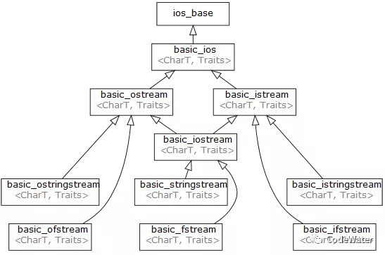
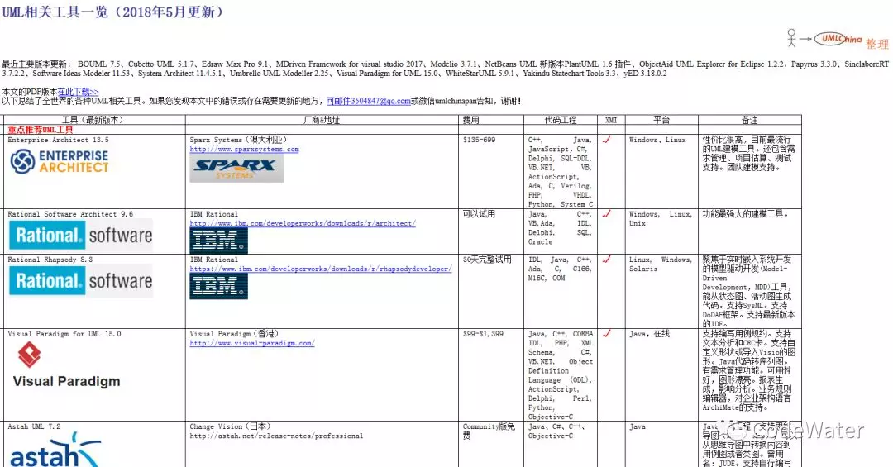
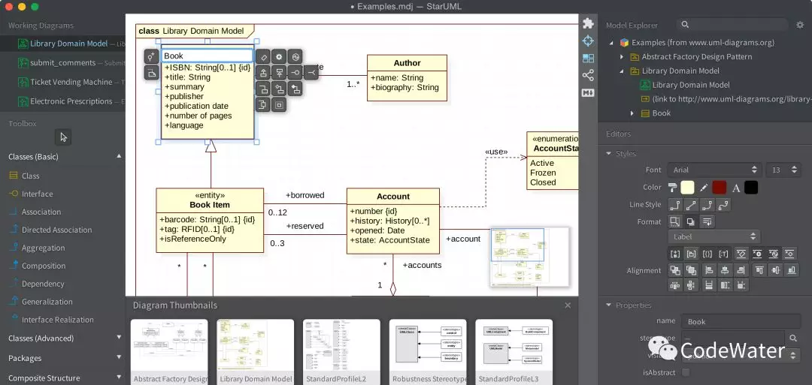

# 拓展：UML与StarUML

UML是Unified Modeling Language的缩写，意为**统一建模语言**，多用于软件系统的可视化建模，也可用于日常工作中的各类结构化设计（比思维导图更标准化一些），比如一个公司的管理结构、各部门之间的协作关系、一项事务的处理流程等。UML通过图的形式来表现元素间的关系或事务的流程，对于理解复杂系统有很好的辅助作用。

如果把一个模型比作一本书，别人做好的模型是已出版的书，自己要建的模型是待写的书，无论是看别人的书还是自己写书，都需要对这本书的内容有一个整体的把握，才能真正看懂或者写好。**UML图**在“看书”或“写书”过程中的作用相当于书的目录，甚至超越目录这一简单的一维知识链表，而上升到**高维知识图谱**的层级，如下面展示的C++ IO流继承关系图（图片来自https://en.cppreference.com/w/cpp/io）。

 

UML图不是凭空产生的，许多模型并没有提供相应的UML图。如果自己在学习的过程中尝试着绘制UML图，将比单纯的文字笔记更加有用。思维导图也有类似的作用，但它符合思维的发散性，对于模型这种严密逻辑型的关系表达不是很好，我也曾试着用思维导图展现代码的结构，总感觉哪儿不对，后来就放弃了:joy:。

网上关于UML的介绍及教学多如牛毛，深浅不一，总能找到符合你自己的内容。这里我想推荐一个[网站](http://etutorials.org/Programming/Learning+uml/)，粗略看了下，感觉里面内容挺翔实的，更为重要的是它的主页Home下还有更多精彩内容！！！

说了这么多理论，也该动动手了，用什么画UML图呢？网上搜一搜，软件也有一大堆，这个[网站](http://www.umlchina.com/tools/newindex1.htm)还专门总结了现有的各种UML软件及特点，可以说相当全面了。

微软Office系列里的Visio支持UML图绘制，但功能相对较弱，用起来不是很方便。公认的最流行的Enterprise Architect功能强大，但学习成本也较高（反正我摸半天也不知道怎么把图拖上去:joy:）。这里我推荐的是标题中的[StarUML](http://staruml.io/)，如封面图所示（图片来自StarUML官网），功能不多不少，界面漂亮，操作简单，自己捣鼓两下也差不多会用了。

But，这是个收费软件，不过激活这事向来难不倒勤劳智慧的人民，百度一下就有各种骚操作，这波操作是我见过的最露骨最打脸的:joy:。放两个教程（[教程一](https://www.52pojie.cn/thread-899541-1-1.html)，[教程二](https://blog.csdn.net/sam_shan/article/details/80585240)）教程一把基本流程讲清楚了，大致思路是：软件装好后到安装目录把激活的文件弄出来，解包查看源代码，把激活部分的代码改掉，再重新打包放回去。但教程一没有细讲怎么改代码，所以有了教程二，结合着看就能明白了。

接下来就是利用新武器给自己开挂了:wink: