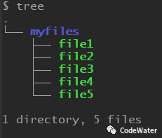
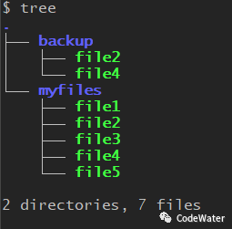
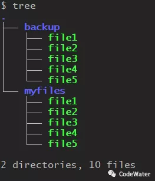
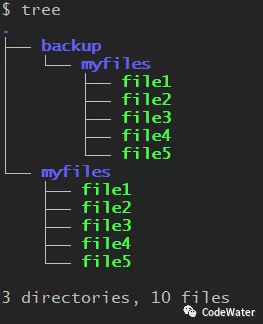
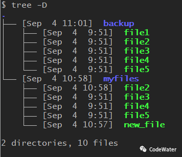
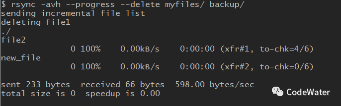
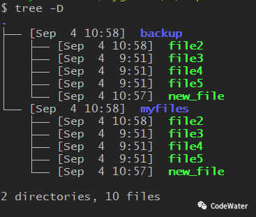

# 拓展：备份神器rsync

**rsync**是一个用于文件同步的命令行工具，官方解释为"a fast, versatile, remote (and local) file-copying tool"，落脚点在于file-copying，但又不同于常规的文件复制。Windows用户在复制文件（夹）时经常遇到下面这个弹窗（同名文件问题）


这时需要用户决定保留哪一个，三五个文件可以手动处理，成百上千则会是一场噩梦，而这经常出现在文件备份的过程中。可能你会说直接全部替换，但日常备份真正需要复制的只是少部分改动或新加的文件，全部替换会浪费大量时间做无用功。这种情况下，rsync就有了用武之地了。

rsync的功能很多，网上教程也不少，手册介绍更是详细，但我们普通人日常用到的往往只是其中一部分，本文主要就**本地备份**这一块儿的功能详细说明一下。

本地备份无非是把重要文件复制一份放到另一个地方（U盘、移动硬盘、本地其它磁盘等），下面模拟一个案例进行说明（Cygwin环境中运行）。

```bash
mkdir myfiles              # 创建一个文件夹用于存放重要文件
touch myfiles/file{1..5}   # 在文件夹中新建一些文件
```

完成后效果如下



现在我们想把file2和file4备份到另一个地方（如backup中），使用rsync命令格式为

```bash
rsync myfiles/file2 myfiles/file4 backup/
```

完成后效果如下



可以看到多出了一个文件夹backup，里面有备份好的file2和file4，这种使用方式与cp类似。

大部分时候，我们不会单个文件地去备份，而是备份整个文件夹，比如我想让backup作为myfiles的备份，那么backup中的内容应该跟myfiles中的内容一致。

```bash
rsync -a myfiles/ backup/    # -a选项用于整体备份
```

完成后效果如下



**注意**：上述命令中myfiles后面的"/"必须带上，表明myfiles和backup是同级别的文件夹，否则myfiles将被视为一个子文件夹备份到backup中，backup后面的"/"则可带可不带。

```bash
rsync -a myfiles backup/    # myfiles后无"/"
```

完成后效果如下（注意与前面对比）




现在看来rsync备份和普通复制粘贴也没啥区别，我们来更新某些文件试试

```bash
touch myfiles/new_file      # 新加一个文件
touch myfiles/file2         # 更新file2
rm myfiles/file1            # 删除file1
```

备份之前是这样的，myfiles中file1没了，file2的时间戳更新了，新加了一个new_file，backup中还保持原样。



```bash
rsync -avh --progress --delete myfiles/ backup/  # 后面再解释各选项意思
```

备份过程如下



可以看出，file1被删除了，file2和new_file进行了复制，其它则没有变化，完成后效果如下




到这里，rsync的基本使用格式也清楚了

```bash
rsync [选项] "待备份的文件文件夹..." "备份位置"
```

下面列举几个本地备份常用的选项：

```bash
-a          备份时常用的打包选项，建议每次都带上
-v          查看备份过程，建议带上
-h          以人类可读的格式显示数据信息，建议带上
--progress  显示备份过程进度，根据喜好使用
--delete    删除备份位置中的多余文件，完全同步时使用
-n          试运行，不实际复制，对执行结果不确定时使用
-b          backup，备份位置中的文件在被替换前重命名成一个复本
-u          update，备份位置中的文件较新时不复制
```


**总结**

```bash
# 完全同步两个文件夹，保持dest和src中的内容完全一致（使用最多）
rsync -avh --delete src/ dest/    # 注意src后的"/"
# 多文件同步，src1...指定的内容与dest中的内容一致
rsync -avh --delete src1... dest/    
# 更新式备份，保持dest中的内容最新，src1...中的内容较旧时将不产生备份
rsync -uavh src1... dest/
# 保留复本式备份，dest中的内容在被替换前会重命名
rsync -bavh src1... dest/
```

如果觉得对你有用，请戳下面的“在看”；如果觉得对别人有用，欢迎分享；如果喜欢本公众号，请加关注哦！:wink:


