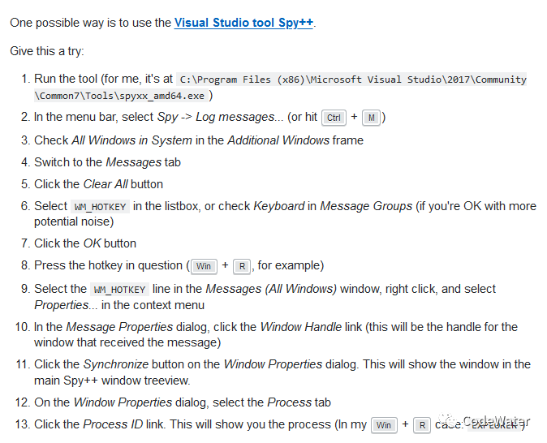

## 杂谈：Win10 快捷键冲突

Original 米博宇 [CodeWater](javascript:void(0);)

**CodeWater**

Weixin ID CodeMiMi

About Feature 分享科研工作中的代码应用，内容涉及水利专业知识、编程基础 (Fortran, Matlab, C/C++)、数据分析、数学建模与实现、杂谈等。

*2019-12-13*

收录于话题

***起因：***想设置一个快捷键（打开微信）。

**问题：**该快捷键已被其它程序占用（微信很礼貌，不强占）。

**方案：**找出占用快捷键的程序，改掉。

**关键：**找不出这个程序！！！

Q：为啥会找不出呢 *[黑人问号脸???]*

A：按快捷键没反应，动作不显形，直接抓不到。

Q：那就在网上找个工具啊，这种问题肯定有人遇到过，把那些快捷键全列出来不就知道了。

A：巧了，这样的工具还真不多，有的只能告诉你快捷键有主了，但主人是谁不知道（比如 HotKeyList），有的把所有快捷键按一遍，分分钟让电脑 / 你崩溃（比如 Windows Hotkey Explorer），有的跟不上 Windows 更新的节奏，Win10 17763 之后就用不了了（比如 PCHunter），总之那个程序仍躲在暗地里偷笑，Huck

Q：不行就一个进程一个进程地关吧，总能试出来

A：实在不行再说吧，我先挣扎一下。。。

中文搜是没希望了，翻墙上 Google 吧，为了这点破事我也是蛮拼的。。。

山重水复疑无路，柳暗花明又一村，终于在 stack overflow 上发现了一丝希望，直接把答案贴出来吧（https://stackoverflow.com/questions/829007/find-out-what-process-registered-a-global-hotkey-windows-api/43645062#43645062）。

一顿操作下来，看到了关键的三个字母 “TIM”，what the huck，TIM 里的快捷键是我亲自设的，根本没有这个，管它呢，既然找到元凶了，先干掉再说，然后微信就屁巅屁巅跑来了

**总结**

------

虽然只是改了微信的快捷键，但推而广之，其它所有的快捷键冲突问题不都可以这么解决么。目前 Win10 下确实缺少这么一个工具能直接查询快捷键的注册程序，唯一强大的 PCHunter 听说也不更了，本来很简单的一个问题，硬是费了这么大周折。相信以后会有更方便的工具 [程序员加油!!!]

米博宇

您的赞赏是对作者的肯定哦😊

**长按识别前往小程序** https://mp.weixin.qq.com/s?__biz=Mzg5NTE3NDk2Ng==&mid=2247483785&idx=1&sn=30bee74eff4327c286e1249f512a9b99&scene=19#wechat_redirect